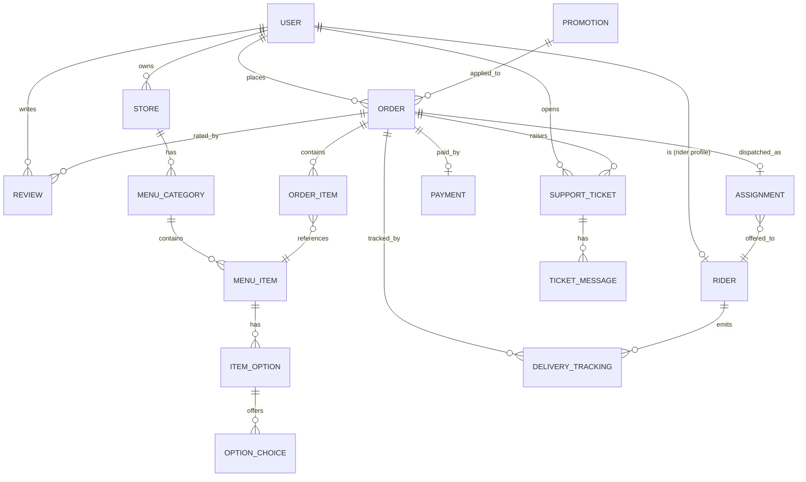

# KaonCDO — Food Delivery POC (build plan)

## 0. Scope (locked)
- New app: `code/food-delivery-poc/` (HailCDO ride demo stays untouched).
- All 5 roles: buyer, store owner, rider, fleet operator, support agent.
- Web only, responsive (≥360px). Perf ignored — working POC.
- Mock auth (persona switcher → stub JWT), mock checkout (COD + fake GCash/card).
- Dummy seed data; placeholder images (picsum seeds); rider marker reuses HailCDO `car.svg`.
- CDO map (Centrio → Uptown corridor), Leaflet + public OSRM (self-host swap later via env).
- Currency PHP (₱), timezone Asia/Manila.

## 1. Tech stack (verified latest, Sep 2026)
- Web: React 19.3 + Vite 8.3 + TS, React Router 8.4, Tailwind 4.3,
  shadcn-style components, TanStack Query (server state), Zustand (live tracking),
  Motion, react-leaflet 5.0 + Leaflet 1.9.4.
- API: Node 24 + Fastify 5.12 + Drizzle ORM 0.45 + Zod, Socket.IO 4.8.
- DB: Postgres 16 + PostGIS (`postgis/postgis:16-3.4`).
- Cache/realtime: Redis 7 (presence, GEO last-known, idempotency, rate limit).
- Infra: Docker Compose — `web` (nginx serve dist), `api` (:3001), `db`, `redis`.

## 2. Architecture
Browser SPA ←REST + Socket.IO→ Fastify API → Postgres/PostGIS + Redis;
API → public OSRM for route geometry. Services: Orders (state machine,
idempotent create), Dispatch (Redis presence → PostGIS KNN → offers w/ 25s
countdown + re-offer), Tracking ingest (3s pings → Redis GEO + PG rows +
`order.{id}` emits), Support (tickets + refund/reassign actions as order events).
Rooms: `order.{id}`, `city.ops`.

## 3. Data model / ERD
Tables: users, rider_profiles(user_id, vehicle, status, last_location geography),
stores(owner_id, location geography, service_radius_m, is_open),
menu_categories, menu_items, item_options, option_choices,
orders(status: cart→placed→store_accepted→preparing→ready→rider_assigned→
picked_up→delivering→delivered/cancelled; subtotal/deliveryFee/serviceFee/
discount/total; etaMin; timeline[]; pickup_pin), order_items,
payments(mock), offers(order_id, rider_id, status, expires_at),
delivery_tracking(order_id, rider_id, geom, heading, at), reviews,
tickets, ticket_messages, promotions.
GIST indexes on all geography columns.

Business rules: fee = base ₱39 + ₱8/km (Ops-configurable); promos KAON20
(20% off ≤₱100), FREESHIP (delivery fee ₱0); pickup PIN = 4 digits shown to
buyer, rider confirms; cancel allowed before `preparing`; stock = item `is_available`.

## 4. API contract (REST + sockets)
- `GET /health` · `GET /api/stores?cuisine=&sort=` · `GET /api/stores/:id/menu`
- `POST /api/orders` (Idempotency-Key) → `GET /api/orders/:id` · `POST /api/orders/:id/cancel`
- `POST /api/orders/:id/pay` (mock: cod | gcash | card) · `POST /api/orders/:id/review`
- Store: `PATCH /api/store/orders/:id` (accept/reject/preparing/ready) · `PATCH /api/menu-items/:id`
- Rider: `POST /api/rider/presence` (online/offline + lng/lat) · `POST /api/offers/:id/accept|decline`
  · `POST /api/orders/:id/pickup` (PIN) · `POST /api/orders/:id/deliver` · `POST /api/tracking` (ping)
- Ops: `GET /api/ops/live` (riders+orders) · `POST /api/ops/assign` · `POST /api/ops/broadcast` · promos CRUD
- Support: `GET /api/tickets` · `POST /api/tickets` · `POST /api/tickets/:id/messages|resolve|refund`
- Sockets (client→server: `join-order`, `rider-ping`; server→client: `order.updated`,
  `offer.created`, `tracking.point`, `ticket.updated`, `ops.broadcast`).

## 5. User stories (POC slice)
- Buyer: browse/search/filter/sort → menu+options → cart → promo → mock checkout
  → live tracking map + pickup PIN → delivered → rate.
- Store owner: sales dashboard → accept/reject → Preparing→Ready → item
  availability/price edits → reviews.
- Rider: online toggle → offer queue (accept/decline countdown) → PIN pickup →
  **Simulate-run button** (web has no GPS: animates along OSRM route, emits pings)
  → delivered + earnings.
- Fleet operator: live city map (riders/orders by status) → manual
  assign/reassign, broadcasts, fee/promo config, store approval.
- Support: ticket queue (order/role/priority filters) → thread + canned replies →
  refund / reassign / cancel actions → buyer timeline updates.

## 6. UX flows
1. Happy path: place → accept → auto-dispatch nearest → accept → PIN →
   deliver → review.
2. Exceptions: store reject (+mock refund) · rider decline (re-offer) ·
   "rider late" ticket → support reassigns → timeline reflects.

## 7. UI routes (responsive, light shadcn-style)
`/` persona switcher + hero · `/buyer` browse → `/buyer/s/:id` store →
`/buyer/checkout` → `/buyer/track/:id` (map+timeline+PIN) · `/store`
dashboard + order kanban + menu editor · `/rider` home/offers + active delivery
map + earnings · `/ops` fleet map + orders table + assign modal + promos ·
`/support` queue + thread + action bar.
Shared: `packages/shared` (Zod schemas/types/state machine), web `lib/api`,
`lib/socket`, `lib/map` (OSRM sim), seed via `db/`.

## 8. Seed data
6 CDO stores (~8 items each), 4 riders, 5 buyers, 12 historical + live orders,
3 tickets, 2 promos. Images `picsum.photos/seed/<slug>/400/300`.

## 9. Build order (agent-browser-verified each step)
0. Scaffold monorepo + compose + migrate + seed (health endpoints green).
1. API stores/menus/orders/mock-checkout + buyer flow.
2. Store dashboard on same orders.
3. Rider app + Socket.IO + dispatch + tracking animation.
4. Ops map + support queue/actions.
5. Polish: ≤380px, toasts/empty states, demo-script README.

## 10. Runbook
- `docker compose up --build` → web :5173 (dev) / :8080 (prod), api :3001.
- `docker compose exec api npm run db:seed` (re-seed); `db:reset` wipes + reseeds.
- Env: `.env.example` → `.env` (DATABASE_URL, REDIS_URL, OSRM_URL, JWT_SECRET stub).
